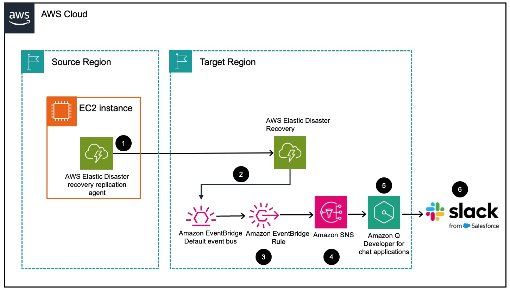
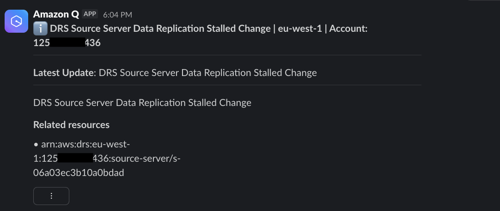

# Guidance for Real-time monitoring of AWS Elastic Disaster Recovery using Amazon Q Developer

## Table of Contents

1. [Overview](#overview-required)
    - [Architecture](#architecture)
    - [Cost](#cost)
2. [Prerequisites](#prerequisites)
    - [Third-party tools](#third-party-tools)
    - [AWS account requirements](#aws-account-requirements)
    - [Supported Regions](#supported-regions)
3. [Deployment Steps](#deployment-steps)
    - [Prerequisites Setup](#prerequisites-setup)
    - [Infrastructure Deployment](#infrastructure-deployment)
    - [Service Integration](#service-integration)
4. [Deployment Validation](#deployment-validation)
5. [Notification Details](#notification-details)
6. [Running the Guidance](#running-the-guidance)
7. [Interactive Capabilities](#interactive-capabilities)
8. [Next Steps](#next-steps)
9. [Cleanup](#cleanup)

## Overview

This solution enables customers to implement comprehensive real-time monitoring and intelligent analysis of their AWS Elastic Disaster Recovery (DRS) environments using Amazon Q Developer (the most capable generative AI–powered assistant for software development). By integrating Elastic Disaster Recovery APIs, CloudWatch metrics, and Q Developer's AI capabilities, this architecture provides seamless visibility into replication health, recovery readiness, and operational insights. Customers can leverage Q Developer's natural language interface to query their Elastic Disaster Recovery environment, analyze server states, and receive intelligent recommendations for optimizing their disaster recovery posture. Rather than relying solely on manual console navigation or basic Amazon CloudWatch dashboards, customers can now interact with their Elastic Disaster Recovery infrastructure through conversational AI that understands disaster recovery concepts and provides contextual guidance. This solution unlocks enhanced Elastic Disaster Recovery monitoring capabilities by enabling customers to gain deeper operational insights and make informed decisions about their disaster recovery strategy through intelligent, real-time analysis powered by Amazon Q Developer.

### Architecture



### Cost

You are responsible for the cost of the AWS services used while running this Guidance. Amazon Q Developer for chat channels is available at no extra cost under the free tier. The serverless architecture leverages pay-as-you-go services with very low usage costs: Amazon SNS ($0.60 per million notifications) and Amazon EventBridge ($1.00 per million events with free delivery to services in the same account). For a typical deployment monitoring 5-10 servers, the estimated monthly cost would likely be under $1, as you would need to generate hundreds of thousands of events to reach even a single dollar in charges. Even for large environments with dozens or hundreds of servers, monthly costs would typically remain under $5 unless you're implementing extensive logging or custom metrics.

## Prerequisites


### Third-party tools

* A Slack channel (private or public)

### AWS account requirements

* You have source server(s) being protected with Elastic Disaster Recovery service.
* You have authorized Amazon Q Developer to access your Slack workspace.

### Supported Regions

This Guidance can be deployed in all regions mentioned here https://docs.aws.amazon.com/chatbot/latest/adminguide/chatbot-regions.html

## Deployment Steps

### Prerequisites Setup
1. Administrator creates and configures Slack workspace integration
   - Create a dedicated Slack channel (private or public) for  Elastic Disaster Recovery monitoring notifications
   - Authorize Amazon Q Developer to access your Slack workspace following the instructions in sections 3 through 3.2.2 of the [blog post](https://aws.amazon.com/blogs/storage/real-time-monitoring-of-
elastic-disaster-recovery-using-amazon-q-developer/)

### Infrastructure Deployment
2. Administrator deploys the monitoring infrastructure using CloudFormation
   - Download the [CloudFormation template](source/realTimeDrsCfn.json) provided in this Guidance
   - Deploy the template via AWS CloudFormation console or AWS CLI to create:
      - Amazon EventBridge rules to capture Elastic Disaster Recovery events
      - Amazon SNS topic for event notifications
      - IAM role for Amazon Q Developer service
      - Amazon Q Developer Slack channel configuration

### Service Integration
3. AWS services automatically establish event flow
   - AWS Elastic Disaster Recovery service generates CloudTrail events when source servers are created, modified, or experience status changes
   - Amazon EventBridge default event bus receives these Elastic Disaster Recovery events automatically
   - The deployed EventBridge rule filters events based on predefined patterns to identify critical Elastic Disaster Recovery events
   - Amazon EventBridge routes matched events to the configured Amazon SNS topic
   - Amazon Q Developer, integrated with your Slack workspace, subscribes to the SNS topic to receive Elastic Disaster Recovery notifications
   - Amazon Q Developer automatically delivers event notifications to your designated Slack channel

## Deployment Validation

To validate deployment, use one or more of the following methods:

* To validate the deployment, open CloudFormation console in your AWS Management Console, click **Stacks** on the left-hand menu, and verify the stack with the name `<STACK_NAME>` has a status of **CREATE_COMPLETE**. After clicking the stack name, click the **Outputs** tab and take note of the **SlackChannelConfigurationArn** and **DRSSlackNotificationTopicArn**.

* If AWS CLI is installed, run the following command to validate the deployment has a status of **CREATE_COMPLETE**, and take note of the **SlackChannelConfigurationArn** and **DRSSlackNotificationTopicArn** output values:
```
aws cloudformation describe-stacks --stack-name <STACK_NAME>
```

## Notification Details

When Elastic Disaster Recovery events occur, Amazon Q Developer delivers structured notifications to your Slack channel containing:

**Event Information**:
- Event title (e.g., API executions such as CreateSourceServerForDrs and Events mentioned in this [AWS documentation](https://docs.aws.amazon.com/drs/latest/userguide/monitoring-event-bridge.html))
- AWS region where the event occurred
- Account ID
- Notification details
- Source server ID

The following example shows a notification delivered to Slack channel when a source server's replication enters a stalled state:



## Running the Guidance

### Install Elastic Disaster Recovery Replication Agent on an EC2 instance.

To test the Guidance, install Elastic Disaster Recovery Replication Agent on an EC2 instance.

### Observe CreateSourceServerForDrs in AWS CloudTrail events history.

After the AWS Replication Agent is installed successfully on an EC2 instance, `CreateSourceServerForDrs` CloudTrail event is generated.

### Wait for the delivery of CloudTrail event notification by Amazon Q into your Slack channel.

Amazon Q Developer is subscribed to Amazon SNS Topic. After receiving the CloudWatch event, Amazon Q Developer will deliver the event into your Slack channel. An example screenshot of such a message is below:


## Interactive Capabilities

Users can then interact with Amazon Q Developer in the Slack channel using natural language queries such as:
- "What is the replication status of my source servers in X region?"
- "Show me source servers with stalled replication"
- "What's the recovery readiness of server X?"

## Next Steps

- Incident tickets can be automatically created and routed to appropriate teams when CloudWatch emits specific events, such as replication stalled events.
- The solution can be deployed at AWS Organizational level montitoring all AWS accounts or a subset of accounts.

## Cleanup

To delete and cleanup deployed resources, use one of the following methods:

- From the [AWS Management Console](https://console.aws.amazon.com) in your web browser, open the CloudFormation console, click **Stacks** on the left-hand menu, select the stack with the name `<STACK_NAME>`, and click **Delete**.
- If AWS CLI is installed, run the following command: 
```
aws cloudformation delete-stack --stack-name <STACK_NAME>
```
